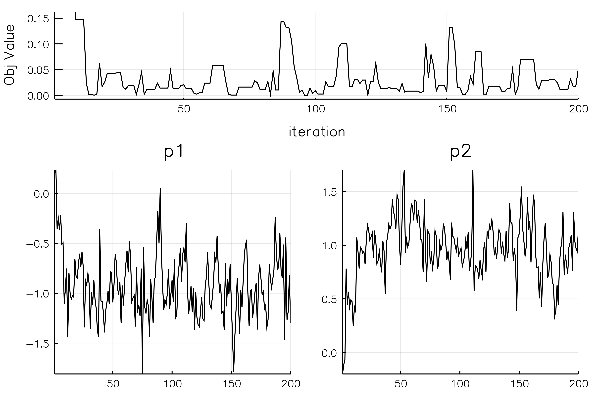
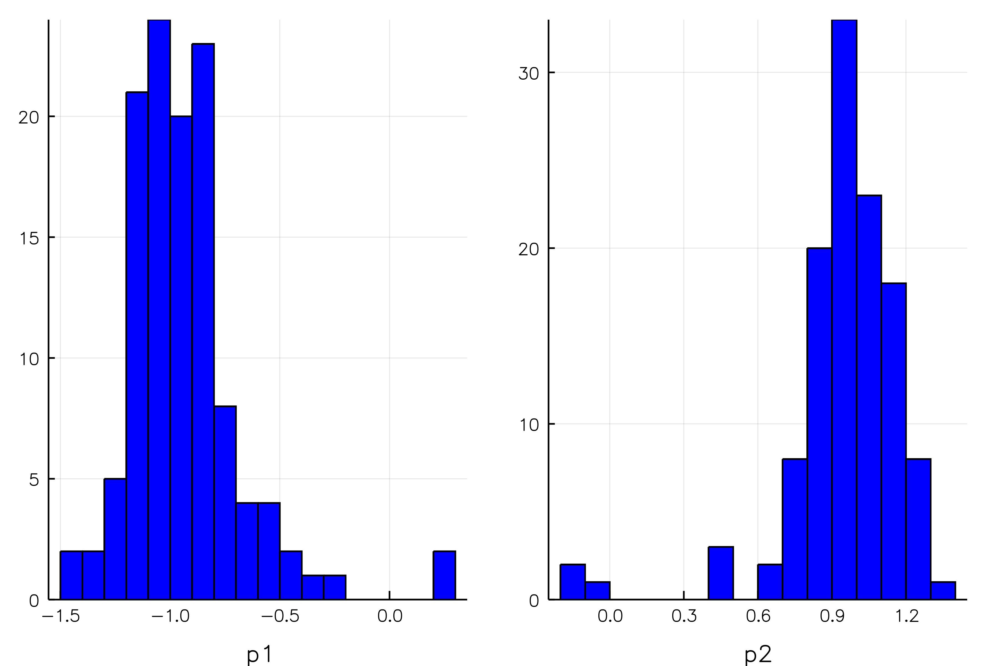

# Examples


## Estimating Means of a bivariate normal


Let's define a function that returns a Normal distribution with a certain location, and let's call this *our model*:

```math
m(p) = \mathcal{N}\left( [p_1,p_2]^T , I_2 \right)
```

Our aim will be to estimate the location of two means from data that is simulated from this law with an MCMC chain, given some *true* ``p``. (Of course the sample mean would be a perfectly valid estimator.) 
The twist here is that we will pretend that we don't have access to the entire simulated dataset 

```math
\{X_i\}_{i=1}^N, X_i = (x_{i1},x_{i2}) \sim m(p),
```

but only a set of summary statistics ``S`` - in our case, we'd have two moments of this data, namely ``\mu_j = \frac{1}{N}x_{ij},j=1,2``. Our objective function is the squared distance between ``\mu``, and what our model produces instead. That is, we give a parameter vector ``p'`` to our model ``m``, which in turn produces 2 *simulated* moments denoted ``\mu'``. Finally, we assess their respective distance - we want to eventuall find ``p' \approx p``.

Again: 

1. Assume *true* moments ``\mu`` (and, hence, true ``p``)
1. repeatedly create data from ``m(p')`` for different ``p'`` drawn from a space ``[-3,3] \times [-2,2]``. For each dataset, compute ``\mu_j' = \frac{1}{N}x_{ij},j=1,2``.
1. Compute distance ``\mu,\mu'`` and decide according to the [`SMM.MAlgoBGP`](@ref) algorithm whether to accept or reject current ``p'``. 

```julia-repl
julia> using SMM
julia> pb    = OrderedDict("p1" => [0.2,-3,3] , "p2" => [-0.2,-2,2] )  # param spaces
julia> moms  = DataFrame(name=["mu1","mu2"],value=[-1.0,1.0],weight=ones(2))  # truth
julia> mprob = MProb() 
julia> addSampledParam!(mprob,pb) 
julia> addMoment!(mprob,moms) 
julia> addEvalFunc!(mprob,objfunc_norm)

julia> nchains = 3

julia> opts =Dict("N"=>nchains,
    "maxiter"=> 10,
    "maxtemp"=> 5,
    "coverage"=>0.025,
    "sigma_update_steps"=>10, 
    "sigma_adjust_by"=>0.01, 
    "smpl_iters"=>1000,
    "parallel"=>true, 
    "min_improve"=>[0.05 for i in 1:nchains], 
    "mixprob"=>0.3, 
    "acc_tuners"=>[12.0 for i in 1:nchains], 
    "animate"=>false)

julia> MA = MAlgoBGP(mprob,opts)

BGP Algorithm with 3 BGPChains
============================

Algorithm
---------
Current iteration: 0
Number of params to estimate: 2
Number of moments to match: 2

julia> run!(MA)
[ Info: Starting estimation loop.
Progress: 100%|████████████████████████████████████████| Time: 0:00:04
┌ Warning: could not find 'filename' in algo.opts
└ @ SMM ~/.julia/v0.6/SMM/src/mopt/AlgoAbstract.jl:69
[ Info: Done with estimation after 0.1 minutes

```

Full list of options is available at the [`SMM.BGPChain`](@ref) documentation

## Diagnostic tools

For this running example, here are a couple of plots that can easily be generated with the package.

### 1. Objective function and param values history

* This can be generated via `plot(MA.chains[1])` (i.e. plots the first chain). `MA` is the final object of the above example.



### 2. Histograms of parameter values 

Plot a histogram of all *accepted* parameter values:

```julia
histogram(MA.chains[1])
```



### 3. Slices through objective and moment functions 

This can be generated via

```julia
s = doSlices(mprob,30)
plot(s,:value)  # plot objective function over param values
plot(s,:mu1)  # plot value of moment :mu1 over param values
plot(s,:mu2)  # plot value of moment :mu2 over param values
```

The moment function plots show with red dashes the true moment value, and how the corresponding simulated moment changes as we move parameter ``p``. This basically illustrates how and whether moment ``m_i`` contributes to the *identification* of the model.


Finally, the slice through the objective function illustrates whether we attain a local maximum (in this case at the true parameter values ``p = (-1,1)``).


### 4. Tracking proposals

* The variance of the [`SMM.proposal`](@ref) kernel is updated every `sigma_update_steps` as set in the `opts` for the [`SMM.MAlgo`](@ref).
* There is a plotting method which can generate a gif of its evolution.
* Just set `animate = true` in the `opts`, e.g.

```julia
opts =Dict("N"=>nchains,
    "maxiter"=>200,
    "maxtemp"=> 5,
    "smpl_iters"=>1000,
    "parallel"=>false,
    "min_improve"=>[0.0 for i in 1:nchains],
    "acc_tuners"=>[20;2;1.0],
    "animate"=>true)
```

In the current example, this yields


